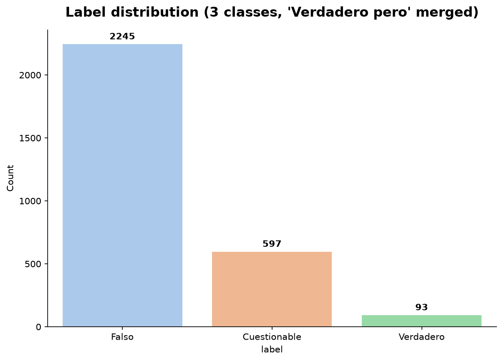
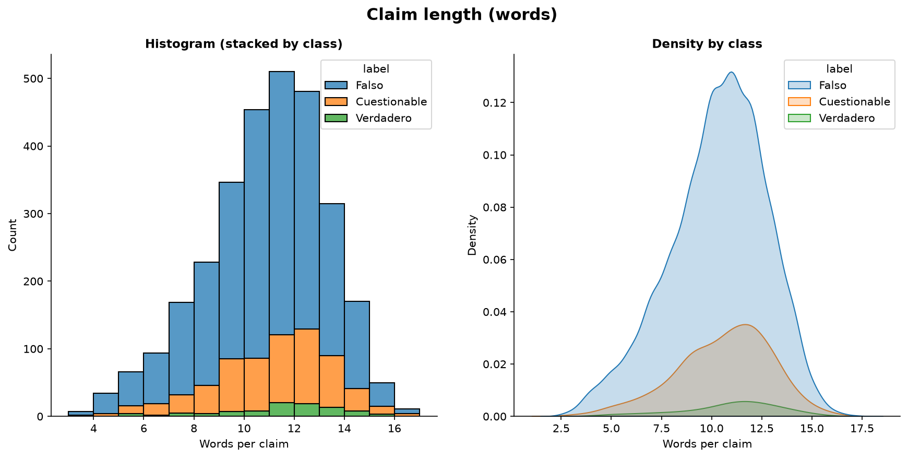
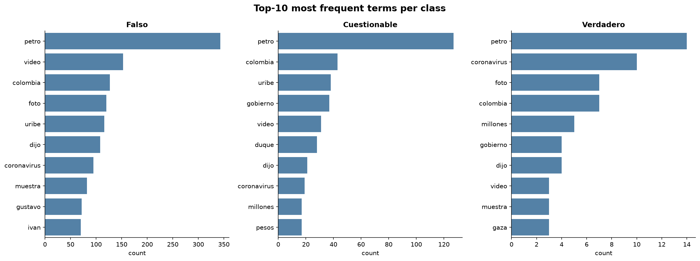
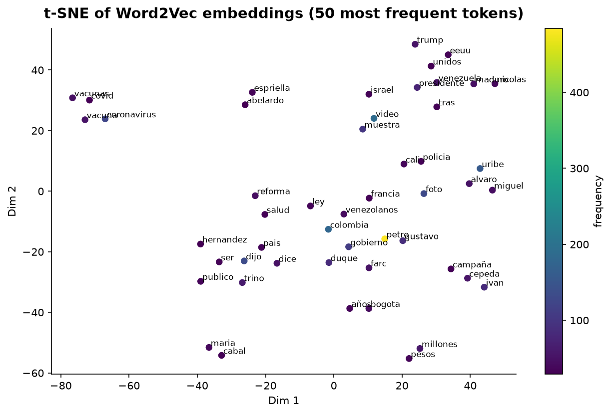
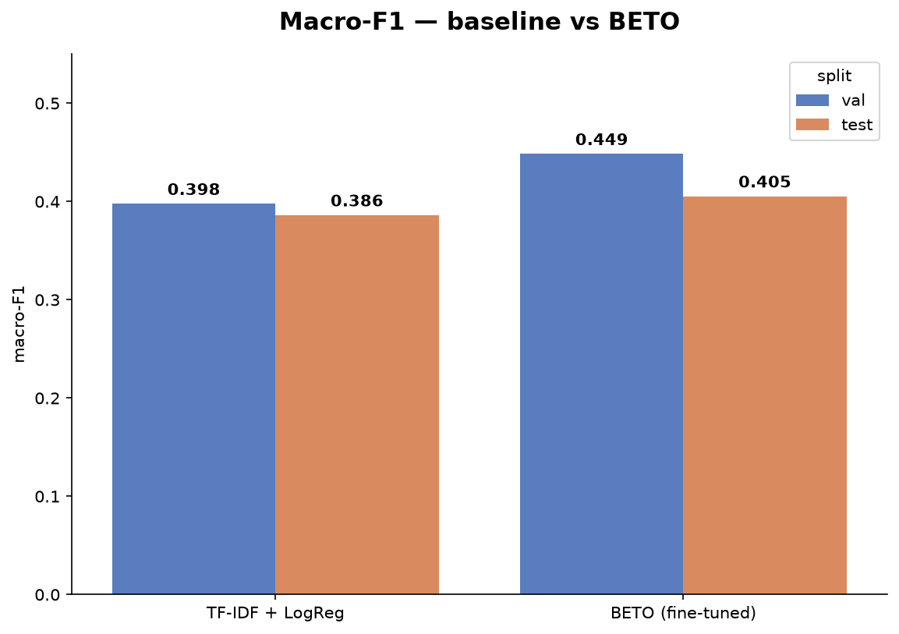
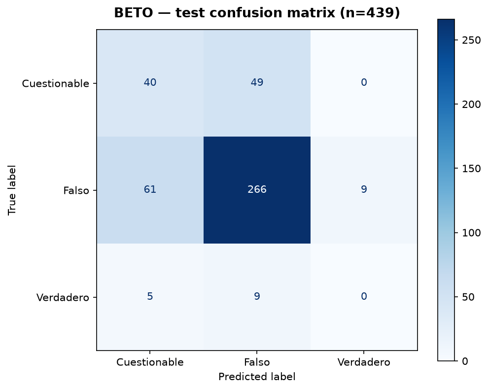

# NLP · Fake News Colombia — verdict classification over ColombiaCheck

[](https://github.com/POLUX89/NLP-Fake-News-Colombia/actions/workflows/ci.yml)


NLP classification of the fact-check **verdict** assigned by
[ColombiaCheck](https://colombiacheck.com), from the text of the claim being
checked, together with data- and model-governance documentation: **Model Card**,
**Datasheet** and **Data Statement**.

> ⚠️ **What this project is — and is not.**
> The model learns to reproduce **how ColombiaCheck labeled** each claim, from the
> claim text. It is **not** a truth detector nor a "fake-news detector": it learns
> surface features and topics correlated with the labels of a **single**
> organization. This limitation is stated explicitly in the
> [Model Card](docs/MODEL_CARD.md) and [Data Statement](docs/DATA_STATEMENT.md).
> Treating it honestly is a central goal of this repository.

## Project phases

| Phase | Status | Deliverable |
|-------|--------|-------------|
| 0 · Environment + repo | ✅ | `pyproject.toml` (Python 3.13), structure, CI, pre-commit |
| 1 · Reconnaissance | ✅ | [`colombiacheck_recon.py`](colombiacheck_recon.py) → `recon_output/` |
| 2 · Data acquisition + EDA | ✅ | claim corpus (`data/raw/claims.csv`) + [`notebooks/01_EDA.ipynb`](notebooks/01_EDA.ipynb) |
| 3 · Data pipeline + NLP model | ✅ | [`features.py`](src/fake_news_co/features.py) (frozen 70/15/15 split) · TF-IDF baseline · fine-tuned BETO ([`model.py`](src/fake_news_co/model.py), [`notebooks/02_MODELING.ipynb`](notebooks/02_MODELING.ipynb)) |
| 4 · Governance + demo | 🚧 | Datasheet ✅ · Model Card ✅ · Data Statement ✅ · Streamlit app + HF Hub release (pending) |

## The corpus

Built by harvesting the **ClaimReview markup (schema.org JSON-LD)** of every
chequeo with [`src/fake_news_co/acquisition.py`](src/fake_news_co/acquisition.py).

- **4,756** unique chequeos in the archive (recon `2026-07-20`).
- **2,941** carry a `claim_reviewed` (61.8%); after de-duplicating on the claim
  text and dropping 2 URL-only "claims" → **2,935** modeling instances, with a
  stratified 70/15/15 split **frozen** by
  [`features.py`](src/fake_news_co/features.py) (seed 42). Time span
  `2018-10-26` → `2026-07-16`.
- **Model input = `claim_reviewed`**: the *neutral* claim as originally made
  (~10 words), **not** the article headline. The headline states the verdict
  (e.g. *"No, this image is not…"*) and would leak the label; the neutral claim
  does not. The full article body is deliberately **not** collected (it argues
  the verdict → even worse leakage, plus copyright).
- **Label = `rating`** (the ClaimReview `reviewRating`), **not** the listing
  `verdict`. The listing verdict is derived from card text by a fragile
  first-match heuristic that mislabels any headline containing the word
  *"verdadero"*; `rating` comes from structured markup and is complete. See the
  [Datasheet](docs/DATASHEET.md).

**Modeling target** (3 classes, after merging `Verdadero pero` into `Verdadero`):

| Label | n | % |
|-------|----:|----:|
| Falso | 2,245 | 76.5 % |
| Cuestionable | 597 | 20.3 % |
| Verdadero | 93 | 3.2 % |

**Central challenge:** severe class imbalance (and only ~10 words of text per
claim) → macro-F1 as the metric, and class weighting during training. The
ClaimReview selection is non-random and disproportionately drops the minority
classes; this bias is quantified in the Datasheet and Data Statement.

## Exploratory analysis (EDA)

Full analysis in [`notebooks/01_EDA.ipynb`](notebooks/01_EDA.ipynb). All figures
in this README come from the **2026-07 snapshot** (data cutoff `2026-07-16`) and
are regenerated with one command —
[`python -m fake_news_co.figures`](src/fake_news_co/figures.py) — so a future
data refresh only needs to rebuild the dataset and rerun it.

**Label distribution** — severe imbalance after merging `Verdadero pero` into `Verdadero`:



**Claim length** — claims are short (~10 words, max 17) and length does not separate the classes:



**Most frequent terms per class** — the same terms (`petro`, `video`, `colombia`) top every
class, so topic alone does not distinguish the verdict:



**Word2Vec + t-SNE** of the 50 most frequent tokens (colored by frequency), showing topical
clusters (Venezuela politics, COVID/vaccines, armed conflict):



## Model results

Experiments in [`notebooks/02_MODELING.ipynb`](notebooks/02_MODELING.ipynb),
codified in [`model.py`](src/fake_news_co/model.py). Model selection on **val**;
**test evaluated once** with the saved final model. Full details in the
[Model Card](docs/MODEL_CARD.md).

| Model | macro-F1 (val) | macro-F1 (test) | Falso F1 | Cuestionable F1 | Verdadero F1 |
|---|---|---|---|---|---|
| TF-IDF + LogReg (`class_weight`) | 0.398 | 0.386 | 0.743 | 0.351 | 0.065 |
| **BETO (weighted loss)** | **0.449** | **0.405** | **0.806** | **0.410** | 0.000 |



- **BETO beats the TF-IDF baseline** (+0.05 val / +0.02 test macro-F1), with clear
  gains on `Falso` (0.806) and `Cuestionable` (0.410). A SMOTE variant of the
  baseline was statistically equivalent to class weighting and was discarded.
- Bootstrap **95% CI** for BETO's test macro-F1: **[0.371, 0.440]**.
- **The honest headline: `Verdadero` scores 0.0 on test.** All 14 test examples
  are misclassified despite a ~10x class weight — the structural scarcity
  measured in the EDA (93 examples, fading over time: 33 in 2020 → 2 in 2026).
  In practice the model is a `Falso`/`Cuestionable` discriminator; presenting it
  as a truth detector would be a misuse (see the Model Card).



## Structure

```
.
├── colombiacheck_recon.py      # Phase 1: reconnaissance scraper
├── src/fake_news_co/
│   ├── paths.py                # canonical, root-anchored paths
│   ├── acquisition.py          # Phase 2: harvest claim_reviewed
│   ├── features.py             # Phase 3: clean + label + frozen 70/15/15 split
│   ├── model.py                # Phase 3: BETO train / evaluate / predict (CLI)
│   └── figures.py              # regenerates every README figure (CLI)
├── notebooks/
│   ├── 01_EDA.ipynb            # Phase 2: exploratory analysis
│   └── 02_MODELING.ipynb       # Phase 3: baseline + BETO experiments
├── assets/                     # README figures (regenerated by figures.py)
├── data/{raw,processed}/       # datasets (git-ignored)
├── models/                     # trained model + metrics JSONs (git-ignored)
├── app/                        # Streamlit demo (Phase 4)
├── docs/                       # MODEL_CARD · DATASHEET · DATA_STATEMENT
└── tests/
```

## Usage

```bash
python -m venv .venv && source .venv/bin/activate
pip install -e ".[dev]"              # base deps (recon + acquisition)
pip install -e ".[eda,nlp,app,dev]"  # full stack (notebook + model + demo)
pre-commit install                   # strips notebook outputs on commit

# Phase 1 — reconnaissance
python colombiacheck_recon.py --max-pages 5   # smoke test
python colombiacheck_recon.py                 # full archive

# Phase 2 — harvest the claim corpus (resumable, ~2 h; cached)
python -m fake_news_co.acquisition --limit 5  # smoke test
python -m fake_news_co.acquisition            # full harvest

# Phase 3 — build the modeling dataset (frozen split) and train/evaluate
python -m fake_news_co.features               # -> data/processed/dataset.csv
python -m fake_news_co.model train            # fine-tune BETO (MPS/CUDA/CPU)
python -m fake_news_co.model evaluate --split test

# Figures — regenerate every README image from the frozen artifacts
python -m fake_news_co.figures
```

## Ethics & provenance

- The scraper respects `robots.txt` (`/chequeos` is allowed), identifies itself
  in the `User-Agent`, caches locally, and throttles at 1.5 s.
- The corpus is built from **public structured data (ClaimReview)**, not
  full-text scraping. Any full-text use requires prior contact with ColombiaCheck
  (`contacto@colombiacheck.com`).
- Chequeo text is **not** redistributed: `data/` is git-ignored and an
  `nbstripout` pre-commit hook strips notebook outputs so raw claim text never
  lands in the repo. Full details in the [Datasheet](docs/DATASHEET.md).

## License

MIT for the code. Chequeo texts are ColombiaCheck's property and are **not**
redistributed in this repository.
